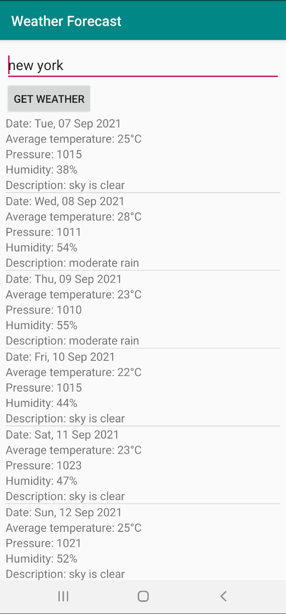
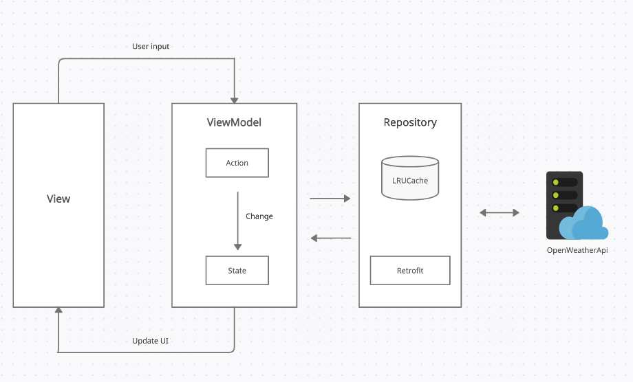
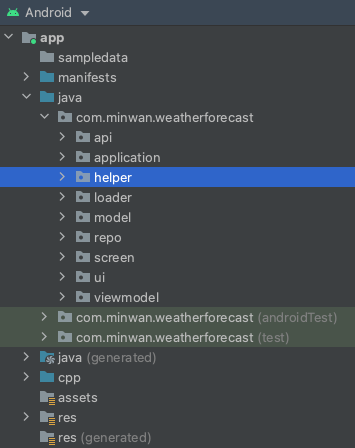
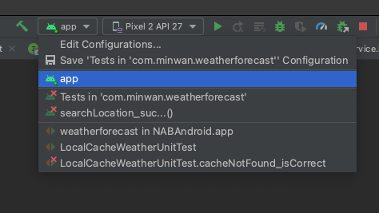
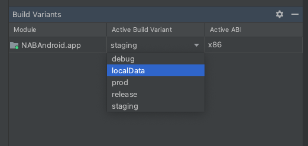

Simple application which get response from OpenWeatherMaps API by region/city name

✅ --> Done

❌ --> Not implemented yet

<h2>List of features</h2>

✅ 1. Programming language: Kotlin is required, Java is optional.

✅ 2. Design app's architecture (suggest MVVM)

✅ 3. Apply LiveData mechanism

✅ 4. UI should be looks like in attachment.

✅ 5. Write UnitTests

✅ 6. Acceptance Tests

✅ 7. Exception handling

✅ 8. Caching handling

9. Secure Android app from:
  
      ❌ a. Decompile APK
  
      ❌ b. Rooted device
  
      ✅ c. Data transmission via network: force to use TLS and add trusted certificates
  
      ✅ d. Encryption for sensitive information: use so lib to store sensitive app key
 
 10. Accessibility for Disability Supports:

      ❌ a. Talkback: Use a screen reader.
      
      ❌ b. Scaling Text: Display size and font size: To change the size of items on your screen, adjust the display size or font size.
      
      
 
 <h3>Brief explanation for the software development principles, patterns & practices being applied</h3>
 
  This project applied MVVM design pattern. With viewModel which will handle data for application/screen and drive UI.
  
  Also apply coroutine to simplify alot of works with asynchronous request
         
  Use JNI to hide some sensitive information (for appId key)
  
  Use simple LRU cache for client cache data, prevent from wasting request API
  
  <b>App architecture</b>
  
  
  
 
  
 <h3>Brief explanation for the code folder structure and the key Java/Kotlin libraries and frameworks being used</h3>
 
 💡<b>Folder structure</b>
 
  
 
 api: For api service and resposne
 
 application: application class
 
 helper: for generic function
 
 loader: JNI loader
 
 model: for model class
 
 repo: for any source repo we need to get data from
 
 screen: for activity / screen
 
 ui (adapter / viewholder / view): contains all item we need to display on screen
 
 viewmodel: for viewModel which handlle logical between data and UI
 
  
  
💡<b>Lib/framework used in this project</b>
 
 AndroiX
 
 Kotlint/Coroutine
 
 Retrofit
 
 ViewBinding
 
 Gson
 
 JUNIT
 
 MockServer
 
 Espresso
  
  
 <h3>All the required steps in order to get the application run on local computer</h3>
 
 1. Import project with default AndroidSDK/NDK
 2. Make sure you pick "app" in build mode
  
 3. Select build variant "staging" for development environment
 
  
 <b>For instrumented testing, please change build variant to localData<b>
  
 After that app will be in mocking data mode, allow to use mockServer data as response for testing
  
  
  
